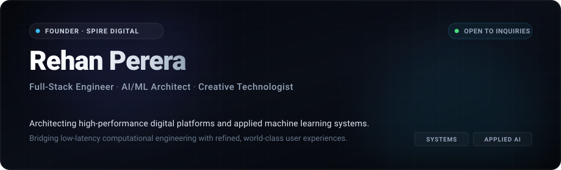

<!-- ==================== EDITORIAL STUDIO HEADER ==================== -->

 

<!-- ==================== REFINED EDITORIAL SUBTITLE ==================== -->

  
  
  
  

---

### Executive Overview

I engineer high-performance web platforms, scalable distributed systems, and applied machine learning architectures. 

With a background spanning systems programming, modern full-stack development, and neural network integration, I focus on building digital products that balance computational efficiency with world-class user experience.

Currently leading engineering and product development at **[Spire Digital](#-venture-spotlight--spire-digital)**, delivering bespoke digital platforms and intelligent automation systems for modern enterprises.

---

### Core Pillars

<table>
  <tr>
    <td width="33.3%" valign="top">
      <h4>01 / Systems &amp; Full-Stack</h4>
      

        Designing scalable, resilient web applications and microservices using TypeScript, Python, and C. Focused on clean architecture, low latency, and robust API design.
      

    </td>
    <td width="33.3%" valign="top">
      <h4>02 / Applied AI &amp; ML</h4>
      

        Architecting neural pipelines, fine-tuning workflows, and embedding-driven retrieval systems using PyTorch and modern deep learning frameworks.
      

    </td>
    <td width="33.3%" valign="top">
      <h4>03 / Creative Technology</h4>
      

        Crafting fluid, high-fidelity digital interfaces with Next.js, React, and Tailwind CSS that elevate brand identity and user engagement.
      

    </td>
  </tr>
</table>

---

### 🌐 Venture Spotlight &bull; Spire Digital

<table>
  <tr>
    <td>
      <h3>Spire Digital &mdash; Digital Engineering &amp; AI Studio</h3>
      

        <b>Spire Digital</b> is a specialized digital agency engineering tailored web solutions, enterprise web applications, and intelligent AI automation workflows. We partner with ambitious founders and organizations to build robust, scalable digital foundations.
      

      <ul>
        <li><b>Bespoke Web Platforms:</b> End-to-end development of modern web applications powered by Next.js, Node.js, and cloud edge networks.</li>
        <li><b>AI Systems &amp; Integrations:</b> Custom LLM workflows, automated data pipelines, and intelligent interfaces embedded directly into business logic.</li>
        <li><b>Cloud Infrastructure &amp; Performance:</b> Scalable, secure architectures deployed across AWS, Cloudflare, Docker, and Vercel.</li>
      </ul>
      

        <i>Inquiries &amp; Partnerships: Open for strategic projects and technical consultations.</i>
      

    </td>
  </tr>
</table>

---

### Technical Capabilities

#### Core Languages &amp; Systems

  
  
  
  
  
  

#### Frameworks &amp; Applied AI

  
  
  
  
  
  
  

#### Cloud, DevOps &amp; Data

  
  
  
  
  
  
  

---

### Engineering Analytics

<table border="0">
  <tr>
    <td align="center" width="50%">
      
    </td>
    <td align="center" width="50%">
      
    </td>
  </tr>
  <tr>
    <td colspan="2" align="center">
      
    </td>
  </tr>
</table>

---

### Contact &amp; Connect

* **LinkedIn:** [linkedin.com/in/rehan-perera-09a9752b6](https://www.linkedin.com/in/rehan-perera-09a9752b6/)
* **GitHub:** [github.com/Rehanperer](https://github.com/Rehanperer)
* **Direct Inquiries:** [rehan@spiredigital.com](mailto:rehan@spiredigital.com)

 

  Designed &amp; engineered with precision &bull; &copy; Rehan Perera

