<div align="center">

<!-- ==================== ANIMATED RETRO CRT TERMINAL HEADER ==================== -->
<a href="https://github.com/Rehanperer">
  
</a>

<br/>

<!-- ==================== QUICK STATUS PILLS ==================== -->
<p align="center">
  
  
  
  
</p>

<!-- ==================== RETRO TYPING QUOTE ==================== -->
<a href="https://git.io/typing-svg">
  
</a>

</div>

---

### 📡 `01 // SYSTEM_DOSSIER [whoami]`

```yaml
# ========================================================
# [ REHAN_OS // CORE IDENTITY MATRIX ]
# ========================================================
operator:
  name: "Rehan Perera"
  callsign: "Rehan"
  archetype: ["Full-Stack Engineer", "AI/ML Architect", "Creative Technologist"]
  current_directive: "Founder & Lead Architect at Spire Digital"
  specialization:
    - High-Performance Web & Cloud Infrastructures
    - Deep Learning & Applied AI Neural Systems
    - Low-Latency Backend & Systems Programming (C / Python)
    - Next-Generation Immersive Digital Products
  motto: "Where raw computational power meets cinematic web engineering."
  coordinates: "Global / Remote"
```

---

### 🚀 `02 // VENTURE_SPOTLIGHT [spire_digital]`

<table>
  <tr>
    <td width="100%" style="background-color: #070c18; border: 1px solid #00f3ff; border-radius: 8px; padding: 18px;">
      <h3 style="color: #00f3ff; margin-top: 0;">
        ⚡ SPIRE DIGITAL &mdash; <span style="color: #39ff14; font-size: 14px;">[ ACTIVE VENTURE ]</span>
      </h3>
      <p style="color: #cbd5e1; font-size: 14px; line-height: 1.6;">
        <b>Spire Digital</b> is an elite digital engineering and creative agency. We architect bespoke, hyper-optimized web ecosystems, intelligent AI automation pipelines, and unforgettable user experiences for forward-thinking brands and startups.
      </p>
      <p>
        
        
        
        
      </p>
      <p style="color: #94a3b8; font-size: 13px;">
        💡 <i>Interested in collaborating or building high-impact digital infrastructure? Let's connect.</i>
      </p>
    </td>
  </tr>
</table>

---

### ⚡ `03 // WEAPONS_OF_CHOICE [tech_arsenal]`

<div align="center">

<!-- Programming Languages -->
<p><b>&gt;&gt; CORE_LANGUAGES</b></p>
<p>
  
  
  
  
  
  
  
  
</p>

<!-- Frameworks & AI Ecosystem -->
<p><b>&gt;&gt; FRAMEWORKS &amp; AI_ECOSYSTEM</b></p>
<p>
  
  
  
  
  
  
  
</p>

<!-- Cloud, Edge & Infrastructure -->
<p><b>&gt;&gt; CLOUD, DEVOPS &amp; RUNTIMES</b></p>
<p>
  
  
  
  
  
  
  
</p>

</div>

---

### 📊 `04 // COMBAT_TELEMETRY [github_stats]`

<div align="center">

<table border="0">
  <tr>
    <td align="center" width="50%">
      
    </td>
    <td align="center" width="50%">
      
    </td>
  </tr>
  <tr>
    <td colspan="2" align="center">
      
    </td>
  </tr>
</table>

</div>

---

### 🕹️ `05 // ARCADE_ZONE [contribution_snake]`

<div align="center">
  <picture>
    <source media="(prefers-color-scheme: dark)" srcset="https://raw.githubusercontent.com/Rehanperer/Rehanperer/output/github-contribution-grid-snake-dark.svg" />
    <source media="(prefers-color-scheme: light)" srcset="https://raw.githubusercontent.com/Rehanperer/Rehanperer/output/github-contribution-grid-snake.svg" />
    
  </picture>
</div>

---

### 📡 `06 // TRANSMISSION_FREQUENCIES [connect]`

<div align="center">

<p><b>&gt; INITIATE_HANDSHAKE: Establish direct link across secure channels:</b></p>

<a href="https://www.linkedin.com/in/rehan-perera-09a9752b6/" target="_blank">
  
</a>
<a href="https://github.com/Rehanperer" target="_blank">
  
</a>
<a href="mailto:rehan@spiredigital.com" target="_blank">
  
</a>

<br/><br/>

```
[ EOF // REHAN_OS TELEMETRY RECORDED // ALL SYSTEMS NOMINAL ]
```


</div>
