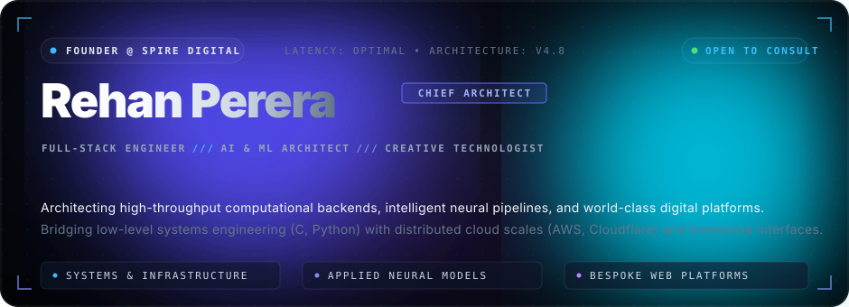
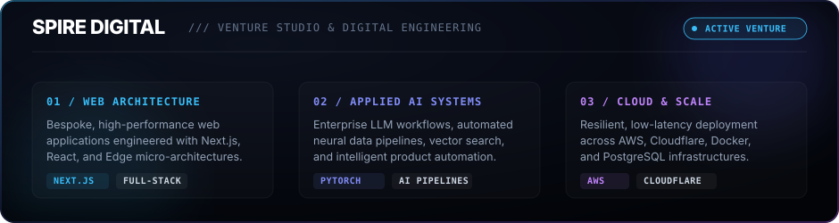
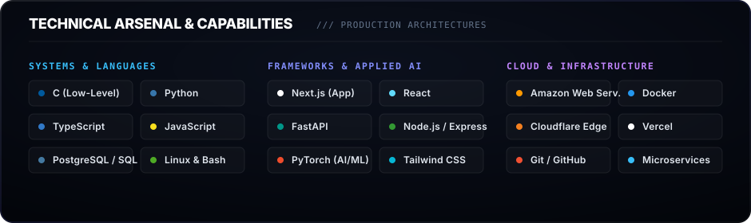

<!-- ==================== CINEMATIC HERO BANNER ==================== -->

 

<!-- ==================== EXECUTIVE DIRECTORY BAR ==================== -->

  
  &nbsp;
  
  &nbsp;
  

 

<!-- ==================== ARCHITECTURAL MANIFESTO ==================== -->
<blockquote>
  

    <b>"Bridging low-latency computational rigor with applied machine intelligence and world-class digital product design."</b>
  

</blockquote>

 

<!-- ==================== CORE PILLARS GRID ==================== -->

  

 

<!-- ==================== SPIRE DIGITAL VENTURE SPOTLIGHT ==================== -->

  

 

<!-- ==================== TECHNICAL ARSENAL MATRIX ==================== -->

  

 

---

### Live Engineering Telemetry

<!-- Activity Telemetry Graph -->

  

<table border="0" style="border: none; background: transparent;">
  <tr>
    <td align="center" width="50%" style="border: none;">
      
    </td>
    <td align="center" width="50%" style="border: none;">
      
    </td>
  </tr>
  <tr>
    <td colspan="2" align="center" style="border: none;">
      
    </td>
  </tr>
</table>

 

<!-- ==================== TRANSMISSION & FOOTER ==================== -->

  Available for strategic architecture consultations, high-scale web platforms, and applied AI deployments.

  

&copy; Rehan Perera &bull; Founder &amp; Chief Architect @ Spire Digital

